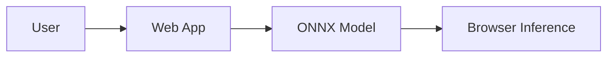

# 🚀 Vision AI Edge – Frontend (PRO)

Versión profesional del README con diagramas y guía rápida.

## 🌐 Entrada
https://oscavi.github.io/hello-world/guide-complete.html

## 🏗️ Arquitectura

## 🔗 Apps
- guide-complete.html
- model-dashboard.html
- saas-panel.html
- vision-yolo-adaptive-auto.html

## ⚡ Uso
1. Abrir app
2. Poner base `/modelos/.../latest/`
3. Ejecutar

## 🧠 Decisiones
ONNX + INT8 + AUTO selector

## 🎯 Regla
Privado=cerebro · Público=interfaz
